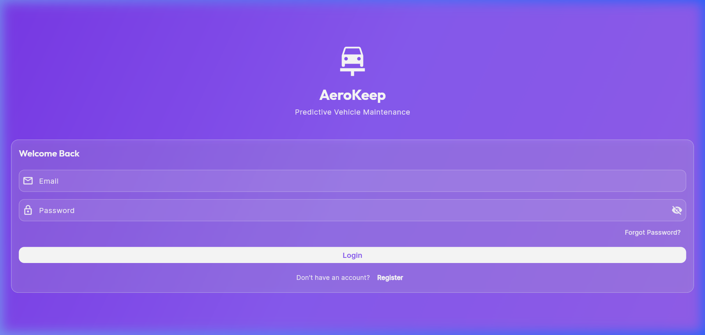
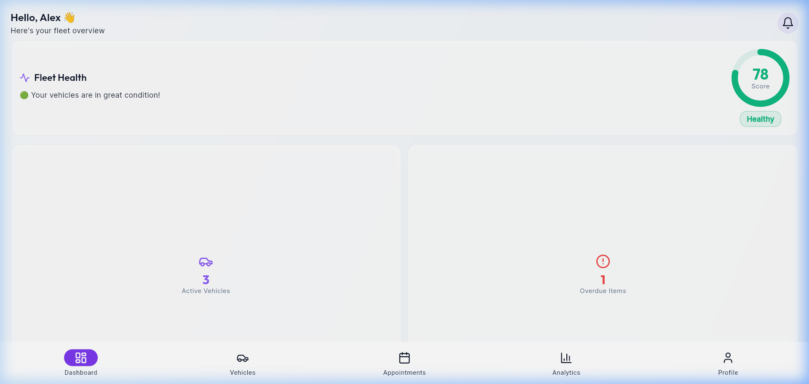
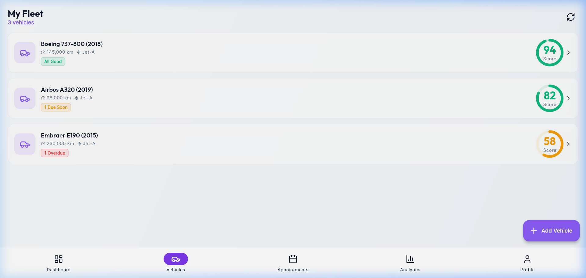
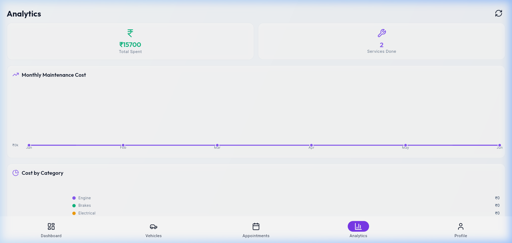
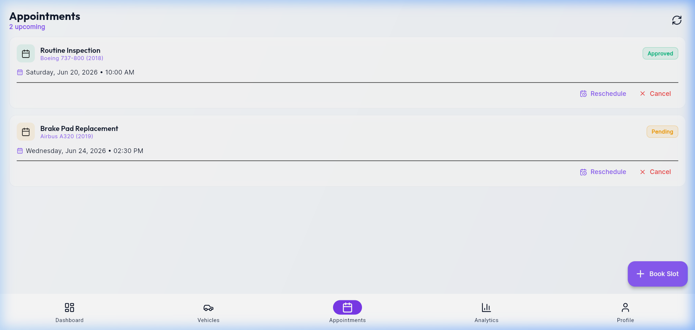

# AeroKeep

**AeroKeep** is a cross-platform Flutter application for predictive vehicle maintenance. It helps drivers and fleet managers monitor vehicle health, schedule service appointments, track maintenance history, and receive timely alerts — all from a single, modern mobile experience.

<p align="center">
  
  
  
  
</p>

---

## Features

| Module | Description |
|--------|-------------|
| **Dashboard** | At-a-glance vehicle health scores, upcoming maintenance, and quick actions |
| **Vehicles** | Add, edit, and manage vehicles with detailed health breakdowns |
| **Appointments** | Schedule and track service appointments |
| **Service Logs** | Record and review maintenance history |
| **Analytics** | Visualize maintenance trends and cost insights with charts |
| **Notifications** | Stay informed about service reminders and alerts |
| **Profile** | Manage account settings and theme preferences |
| **Admin Panel** | Administrative tools for user and appointment management |

---

## Tech Stack

- **Framework:** [Flutter](https://flutter.dev) 3.32
- **Language:** Dart 3.8
- **State Management:** [Riverpod](https://riverpod.dev)
- **Routing:** [go_router](https://pub.dev/packages/go_router)
- **Networking:** [Dio](https://pub.dev/packages/dio) with JWT refresh interceptor
- **Charts:** [fl_chart](https://pub.dev/packages/fl_chart)
- **Secure Storage:** [flutter_secure_storage](https://pub.dev/packages/flutter_secure_storage)
- **UI:** Material 3, Google Fonts, Lucide Icons, glassmorphism components

---

## Project Structure

```
lib/
├── config/          # Theme, routes, and app constants
├── core/
│   ├── network/     # Dio client, API endpoints, mock interceptor
│   └── widgets/     # Shared UI components (glass cards, health gauges)
└── features/
    ├── admin/
    ├── analytics/
    ├── appointments/
    ├── auth/
    ├── dashboard/
    ├── notifications/
    ├── profile/
    ├── service_logs/
    └── vehicles/
```

Each feature follows a **clean architecture** layout with `data`, `domain`, and `presentation` layers.

---

## Getting Started

### Prerequisites

- [Flutter SDK](https://docs.flutter.dev/get-started/install) (3.32 or later)
- [Dart SDK](https://dart.dev/get-started/sdk) (3.8 or later)
- An IDE such as [VS Code](https://code.visualstudio.com/) or [Android Studio](https://developer.android.com/studio)
- For mobile builds: Android SDK and/or Xcode

### Installation

1. **Clone the repository**

   ```bash
   git clone https://github.com/techASH5/intern-flutter-app.git
   cd intern-flutter-app
   ```

2. **Install dependencies**

   ```bash
   flutter pub get
   ```

3. **Run the app**

   ```bash
   # Web (recommended for quick preview)
   flutter run -d chrome

   # Android emulator
   flutter run -d android

   # Windows desktop
   flutter run -d windows
   ```

### Demo Mode

The app ships with a **built-in mock API interceptor**, so it runs fully offline without a backend. All authentication, vehicle data, appointments, and analytics are served from in-memory mock responses — ideal for development and demos.

To connect to a real backend, update `baseUrl` in `lib/config/constants.dart` and remove or disable the `_MockInterceptor` in `lib/core/network/dio_client.dart`.

| Platform | Default API URL |
|----------|-----------------|
| Android Emulator | `http://10.0.2.2:5000/api` |
| iOS Simulator | `http://127.0.0.1:5000/api` |
| Physical Device | Your machine's local IP address |

---

## Build

```bash
# Web
flutter build web

# Android APK
flutter build apk

# Windows
flutter build windows
```

---

## Testing

```bash
flutter test
flutter analyze
```

---

## Screenshots

Here is a visual walk-through of the AeroKeep predictive maintenance app:

### 1. Secure Authentication & Onboarding
User sign-in/sign-up screen featuring a modern glassmorphic theme.
<p align="center">
  
</p>

### 2. Fleet Dashboard & Health Metrics
At-a-glance dashboard displaying vehicle health scores, upcoming maintenance alerts, and interactive KPI cards.
<p align="center">
  
</p>

### 3. Comprehensive Vehicle Management
A full catalog of active aircraft/vehicles, detailing individual registration numbers, manufacturers, model details, odometer readings, and current status.
<p align="center">
  
</p>

### 4. Predictive Analytics & Cost Trends
Interactive visualizations for maintenance costs over time and category-wise spending using high-fidelity charts.
<p align="center">
  
</p>

### 5. Appointments & Maintenance Scheduling
Streamlined scheduling interface where users can coordinate and keep track of pending and approved inspections.
<p align="center">
  
</p>

---

## Contributing

1. Fork the repository
2. Create a feature branch (`git checkout -b feature/your-feature`)
3. Commit your changes (`git commit -m "Add your feature"`)
4. Push to the branch (`git push origin feature/your-feature`)
5. Open a Pull Request

---

## License

This project is open source and available under the [MIT License](LICENSE).

---

## Acknowledgments

Built with Flutter and the open-source packages listed in [`pubspec.yaml`](pubspec.yaml).
